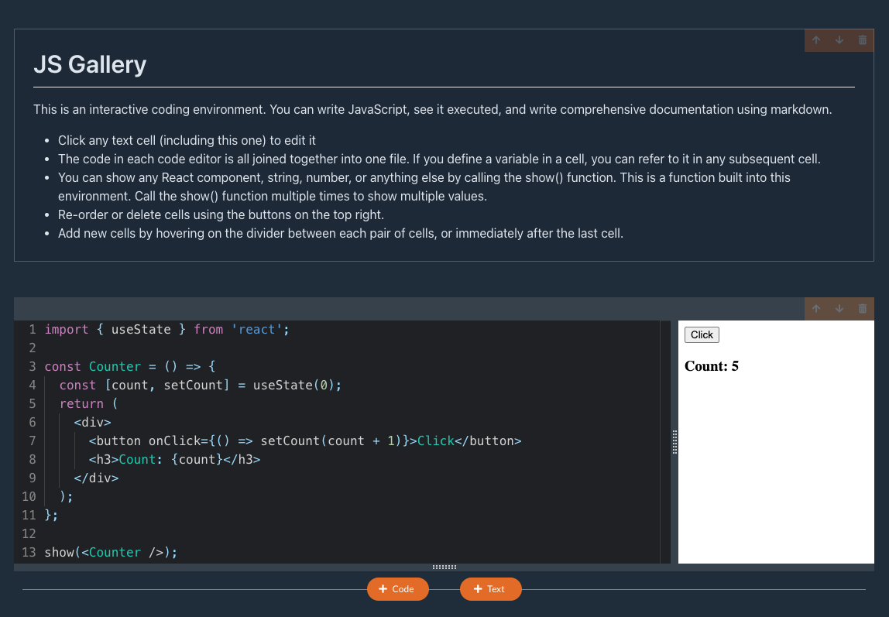

# JavaScript Gallery

JavaScript Gallery is a browser-based application for writing, executing, rendering, and documenting JavaScript and JSX snippets.  It consists of three components:

- CLI
- Local API
- Local Client

The CLI Component is the entrypoint into the JavaScript Gallery application.  It starts up an instance of the Local API Component with the arguments (e.g. filename) specified by the user.  The Local API Component in turn serves up the compiled assets for the Local Client Component and handles the file-based persistence of any number of JavaScript galleries that the user creates and maintains.

The application is started from the command line as follows:

`$> npx js-gallery serve`

 

This wll start the application with the following defaults:

| Parameter Name | Flag         | Default Value | Comment                                                  |
| -------------- | ------------ | ------------- | -------------------------------------------------------- |
| filename       | N/A          | js-gallery.js | Must include a *.js extension. Can include path as well. |
| port           | -p or --port | 4005          | Must be a valid port number, not already in use.         |

 

Therefore, the command specified above is equivalent to the following command:

`$> npx js-gallery serve js-gallery.js -p 4005`

 

 

---

## Running Locally for Development

From the project root, run the following command:

`$> npm start`

From the `/packages/cli/dist` directory, run the following command:

`$> node index.js serve`

The application should now be running and available at `http://localhost:4005`

 

When developing, remember to use lerna (not npm) to add new dependencies when necessary:

`$> lerna add <some dependency> [--dev] [--exact] --scope=<package name>`

 

---

## Publishing to NPM

From the project root, run the following command and respond to the prompts:

`$> lerna publish --no-push`
